<h1 align="center">Hey  I'm Mukul Batra</h1>
<h3 align="center">FullStack Developer</h3>

  

## 📌 About Me
- 💻 MERN Stack Developer with a strong interest in backend systems and real-world problem solving.
- 🚀 I build projects that combine practical use-cases with modern technologies, including AI-powered applications.
- 📚 Currently sharpening my skills in DSA, system design, and scalable architectures.
- 🎯 Focused on growth, consistency, and landing impactful software development roles.

## 🧠 My Focus Areas
- 🎯 Focus Areas
- 💻 Building scalable MERN stack applications
- ⚙️ Designing efficient REST APIs & backend systems
- 🧠 Strengthening DSA for coding interviews
- 🤖 Integrating AI features into web platforms
- 📦 Exploring system design & architecture patterns

## 📊 GitHub Stats & Trophies

  
  

  

  

  

## 🛠️ Languages & Tools

> ## Programming Languages

   

> ## Frontend

    

> ## Backend

 

> ## Database

  

> ## DevOps & Cloud

 

> ## Tools

   

  

## 🔗 Connect with Me

   

<picture>
  <source media="(prefers-color-scheme: dark)" srcset="https://raw.githubusercontent.com/cyprieng/github-breakout/main/example/dark.svg" />
  <source media="(prefers-color-scheme: light)" srcset="https://raw.githubusercontent.com/cyprieng/github-breakout/main/example/light.svg" />
  
</picture>

  

